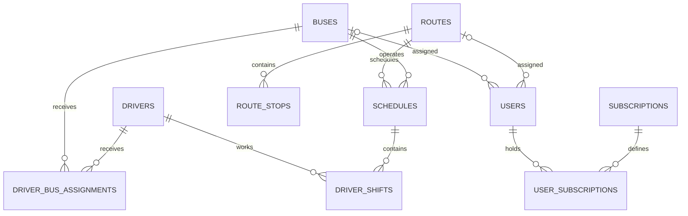

# Shuttle Bus database application

This team project was built for a Database Systems final project. It models shuttle routes, schedules, vehicles, drivers, riders, announcements, and subscriptions in MySQL. PHP pages provide the original prototype interface.

The repository is an educational archive. It is not ready for production deployment. See [Known limitations](#known-limitations) before running the web application.

## Database design

The schema in `bus_app.sql` contains 11 tables.

| Area | Tables | Purpose |
| --- | --- | --- |
| Operations | `buses`, `drivers`, `driver_bus_assignments`, `driver_shifts` | Store the fleet, driver records, vehicle assignments, and work dates. |
| Service planning | `routes`, `route_stops`, `schedules` | Define route geometry, ordered stops, operating times, and assigned buses. |
| Riders | `users`, `subscriptions`, `user_subscriptions` | Store accounts and connect riders to pass types through a junction table. |
| Communication | `announcements` | Store time-limited service notices. |

The schema demonstrates these relational database concepts:

- Primary keys and auto-incrementing identifiers.
- Unique constraints for bus numbers and account email addresses.
- Foreign keys for routes, schedules, vehicle assignments, driver shifts, and subscriptions.
- Junction tables for many-to-many relationships.
- `ON DELETE CASCADE` for dependent records and `ON DELETE SET NULL` for optional user assignments.
- Enumerated status and account-role values.
- InnoDB transactions and `utf8mb4` text storage.



## Public sample data

`bus_app.sql` contains fictional records only. Sample email addresses use the reserved `example.invalid` domain. Phone and license values are marked as demo data. Account password fields contain bcrypt hashes, not plaintext passwords.

Do not treat the fixtures as production seed data. Replace them for any new local experiment.

## Database configuration

`config.php` reads the connection settings from environment variables.

| Variable | Purpose |
| --- | --- |
| `DB_HOST` | MySQL host name or IP address. |
| `DB_PORT` | MySQL port. The default is `3306`. |
| `DB_NAME` | Database name. Use `bus_app` with the included SQL file. |
| `DB_USER` | MySQL user name. |
| `DB_PASSWORD` | MySQL password. |

The application returns a generic error if the configuration is missing or MySQL rejects the connection. Detailed connection values are not sent to the browser.

## Run the database locally

Install PHP 8.1 or later and MySQL 8.0 or later.

1. Create a local environment file.

   ```sh
   cp .env.example .env
   ```

2. Replace every placeholder in `.env`. Set `DB_NAME=bus_app`.

3. Export the variables into the current shell.

   ```sh
   set -a
   source .env
   set +a
   ```

4. Import the schema and fictional fixtures. The MySQL client prompts for the database password.

   ```sh
   mysql --host="$DB_HOST" --port="$DB_PORT" --user="$DB_USER" --password < bus_app.sql
   ```

5. Start the PHP local development server.

   ```sh
   php -S 127.0.0.1:8000
   ```

6. Open `http://127.0.0.1:8000`.

`.env` is ignored by Git. Never commit it.

## Repository layout

- `bus_app.sql` defines the schema, indexes, foreign keys, and fictional fixtures.
- `config.php` creates the shared MySQLi connection from environment variables.
- `authenticate.php` and `register.php` handle account authentication and password hashing.
- The dashboard and process files contain the original role-based PHP prototype.

## Known limitations

This repository preserves a student prototype, not a maintained service.

- Several legacy CRUD endpoints build SQL from request values instead of using prepared statements.
- Some PHP pages refer to older table or column names that are not present in `bus_app.sql`.
- The prototype does not have complete authorization, CSRF protection, automated tests, or deployment configuration.
